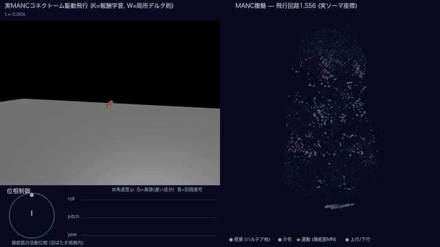
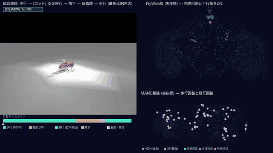

# connectome-fly-biocompensation

**実測コネクトーム駆動の身体シミュレーション** — ショウジョウバエの実測配線図で
物理身体を飛ばし・歩かせ、「配線の個性が行動のどこまで届くのか」を定量した研究。

> 実行には外部データ(MANC / FlyWire / flybody)の配置が必要です。
> → **[SETUP.md](SETUP.md)** を参照してください。
> 元はモノレポ `physical-based-llm` の `fly-integrated/` で、履歴ごと切り出しています。

ショウジョウバエの実測コネクトーム(EM再構成の配線図)を LIF ニューロンで動かし、
物理シミュレータ上の身体と**ミリ秒以下で閉ループ結合**して、実際に飛ばし・歩かせる研究。

---

# Overview

## これは何か

**コネクトーム**とは、電子顕微鏡で脳を薄切りにして全ニューロンと全シナプスを再構成した、
実測の「配線図」である。ショウジョウバエでは脳全体(FlyWire、約13万ニューロン)と
腹髄(MANC、23,188ニューロン。昆虫の「脊髄」にあたる)が公開されている。

配線図が手に入った以上、次の問いは自然に出てくる —
**その配線図で、本当に身体を動かせるのか?**

既存研究の多くは「刺激を入れて応答を見る」開ループか、身体を持たない脳単体のモデルである。
ここでは実測の配線をそのままスパイキングニューロンで動かし、
物理シミュレータ上のハエの身体(翅6+脚48自由度)と**0.1ミリ秒ごとに信号を交換する
閉ループ**で結合した。感覚 → 実配線 → 運動ニューロン → 筋 → 身体 → 感覚、が
実時間で閉じている。



**動画の見方**(すべて同一シミュレーションの実データ。演出用の別データは無い):

| 画面 | 何が映っているか |
|---|---|
| 左上 | 実配線が駆動する飛行。ハエは高度12(体長の約41倍)でホバリングしている |
| 右 | 飛行を駆動している腹髄1,556ニューロンを、**EMデータの実際のソーマ座標**に配置した点群。発火した瞬間に光る。シアン=ハルテア感覚、紫=介在、オレンジ=操舵筋の運動ニューロン、緑=上行/下行 |
| 左下・円 | 羽ばたき1周期を円で表し、白点が現在の翅位相。色付きの針が各操舵筋の活動位相。体が回転すると針が基準からずれる — **このずれが回転の読み取りそのもの** |
| 左下・波形 | 体の回転速度。白=真値、青=回路が読み取った値。青が白に重なって追従している |

## なぜ難しいのか — ハエの飛行制御という問題

ハエの飛行は、制御としてかなり過酷な条件で成立している。

- **羽ばたきが速い**: 約202 Hz。1回の羽ばたきは**5ミリ秒**しかない
- **指令が疎い**: 翅の向きを調節する操舵筋の運動ニューロンは、**1羽ばたきにつき1発**しか
  発火しない(本研究でも位相固定 R=1.00 を実証)。つまり制御指令の更新は5ミリ秒に1回だけ
- **感覚が遅い**: ハエのジャイロは**ハルテア**(後翅が進化した振動する棍棒)だが、
  これは羽ばたき1周期ぶんを平均した「遅い回転成分」しか報告できない。
  自分の羽ばたきの反動振動そのものは読めない
- **身体が不安定**: 羽ばたく身体は放っておくと0.2秒以内に転倒する

**遅く・疎い情報で、速く・不安定な身体を安定させる。** これがこの問題の芯である。

## 閉ループの中身

```
  ハルテア求心性 55本 ──[MANC実配線]──> 操舵筋の運動ニューロン (1周期1発)
        ↑                                          │
        │                                   筋の活動位相
   体の回転                                         │
        │                                    復号 → 回転速度ω
        │                                          │
        │                            1羽ばたき1回の帰還則 → 筋の単収縮
        │                                          │
        └────────── 身体 (MuJoCo) <───────── 翅の運動 ──┘
```

配線・ニューロンの型・筋との対応はすべてMANCの実測データ。
求心性の発火様式、電気シナプス、筋の収縮特性は生理学の文献に基づく補完モデル
(どこが実測でどこが補完かは Detail 第1節に全て開示)。

## 結果1 — 実配線で飛ぶ。そして配線は本当に効いている

| 条件 | 10秒試験の結果 |
|---|---|
| 完全なジャイロを与えた場合(理想の上限) | 10.00秒 / 直立度 +0.90 / 高度誤差 0.4 |
| **実MANCコネクトーム回路** | **10.00秒 / 直立度 +0.92 / 高度誤差 0.6** |
| ハルテア経路を切った場合 | **1.27秒**(墜落) |

*直立度は背中の向き。+1 = 背中が完全に上、0 = 横倒し、−1 = 仰向け。
高度誤差は目標高度からのずれ(体長0.29に対して0.6なので、体長2つぶん程度の範囲に収まっている)。*

**実配線が理想のジャイロと区別できない性能を出し、切ると落ちる。**
コネクトームは飾りではなく、情報を運ぶ実体として機能している。

なお、これが成立するには**筋の単収縮**(筋がスパイクに対して4.25ミリ秒かけて
なめらかに収縮する性質)が必須だった。これが無いと、5ミリ秒に1回の階段状の指令が
高周波の振動を身体に注入し、あらゆる制御則が0.58秒以内に崩れる。

## 結果2 — では「その配線でなければならない」のか(この研究の核心)

「実配線で飛べた」だけでは、実は何も言えていない。**でたらめな配線でも飛べる**かもしれない。
そこで、シナプス数(各ニューロンの入出力の本数)を保ったまま接続先だけをランダムに
繋ぎ替えた**偽の配線を100通り**作り、実配線と比較した。

結果は、見る水準によって答えが変わった。

| 問い | 答え | 統計 |
|---|---|---|
| 実配線は回転を**正確に読み取れる**か? | **はい**。偽配線100個のうち実配線より正確なのは2個だけ | p = 0.030 |
| 実配線でないと**飛べない**か? | **いいえ**。読み取り方を各配線用に学習し直せば、40個中27個の偽配線が同じように飛ぶ。実配線は41構成中9位 | p = 0.22 |

**なぜ「読み取りは正確なのに飛行には差が出ない」のか。**
制御が許容できる読み取り誤差を実測したところ、**相対誤差0.4〜1.5まで飛行は崩れなかった**。
一方、実配線と偽配線の差は0.11 対 0.19〜0.61 — つまり
**配線の優位性は、制御が気にする水準の4〜10分の1しかない**。

「配線に情報が無い」のではない。**情報はあるが、課題の許容度がそれより一桁大きい。**

## 結果3 — 追いかけていた目標のほうが間違っていた

当初は、機械学習で得た「3秒飛ぶ制御器」を教師として、それをコネクトームで再現しようとしていた。
うまくいかず、教師そのものを解剖したところ:

- その教師は、**自分の羽ばたきの反動振動を、帯域無限のジャイロで読んでいた**。
  振動成分だけを取り除くと 3.00秒 → **0.26秒**に崩壊した。実物のハエには取得できない信号である
- さらに、**1秒あたり6,500回以上の指令更新**を必要としていた。
  神経筋系は1秒あたり202回(1羽ばたき1発)。**30〜60倍足りない**

つまり目標のほうがコネクトームで再現不可能だった。
方針を反転し、**神経筋系の制約を先に課してから制御を設計し直した**結果が、結果1である。

## 結果4 — 読み取りも帰還則も「学習」で獲得できる

結果1では、神経の発火から回転を読み取る変換を外部の最小二乗法で較正していた。
これは動物がやっていることではない。そこで生物学的に妥当な学習則に置き換えた。

- **読み取りの獲得**: 教師信号を「視覚由来の遅く粗い回転推定」とし(動物が実際に持つ信号)、
  各シナプスが前段の活動と誤差信号だけを使う**局所デルタ則**で学習。
  **40エピソード(実飛行にして約11秒ぶんの経験)で、外部較正と区別できない10秒飛行**に到達
- **帰還則の獲得**: 同じ突風の中で少しだけ違う制御を2回試し、報酬の差で更新する
  **報酬変調学習**(報酬はハエ自身が感知できる量のみ: 生存・姿勢・高度)。
  **8個体中8個体**が到達。必要な経験は**実飛行10分弱**

このとき見つかった、ハエを離れて一般化する知見:

> **多世代の淘汰(進化的手法)は「生き延びる」だけを報酬にしても、遅れに対する安全余裕を
> 暗黙に獲得する。一方、一個体の勾配学習は安定性の限界ぎりぎりの解を返す。
> 余裕は訓練環境に明示的に入れてやる必要がある。**

## 結果5 — 同じ身体で歩く

同一の身体で歩行も実装した。実自己受容感覚542本 → MANC実配線 → 脚の運動ニューロン
→ サイズ原理に従う筋動員、という経路である。

歩行リズムは**プログラムしていない**。反射ループの一巡ゲインを適切な範囲に入れると、
身体と地面を介したループが自励振動し、**立脚と遊脚のサイクルが創発した**
(4秒間で計109歩、5〜8歩/秒)。ゲインが低すぎるとリズムは出ず、高すぎると転倒する。

## 一言でいうと

**コネクトームは「特別に良い基底」ではなく「十分に良い基底の一つ」である。**

配線の個性は、神経の応答と感覚の読み取り精度には確かに写る。
しかし学習可能な読み取り層を一枚挟むと、行動にも学習速度にも写らなくなる。
機能を作っているのは配線そのものではなく、**配線に合わせて適応した読み取りの側**である。

これは当初期待した「コネクトームだから飛べる」より地味な結論だが、
3つの独立した実験系(再較正・読出し固定・学習曲線)が同じ方向を向いた、
本リポジトリで最も確度の高い結果である。

## 未解決・限界

- **地上からの離陸ができない**。飛行は空中から開始している(動画にも [カット] と明示)。
  約12回の実回路診断の末に未解決 — 原因は Detail 第7節に全て記載
- **歩行は足踏み止まり**で、移動としては弱い
- **脳の視覚回路は並走・可視化しているが、安定飛行の制御ループには未接続**
- 単一の個体コネクトーム・単一の身体モデルでの結果であり、独立再現はしていない
- 電気シナプスなど一部は実測ではなく生理学文献に基づく**補完モデル**(第1節で全て開示)

## ドキュメント

- **[LOG.md](LOG.md)** — 実験の全履歴(追記1〜35)。**撤回した主張と失敗もそのまま残している**
- [../HANDOFF.md](../HANDOFF.md) — 引き継ぎ用(環境・データ・落とし穴)
- [../report22082026.md](../report22082026.md) — 研究報告(統合28〜36)

---

# Detail

## 1. 何が実データで、何が補完で、何が学習か

主張の範囲を明確にするため、構成要素の由来を全て開示する。

| 要素 | 由来 |
|---|---|
| 化学シナプス配線(66,494エッジ) | **MANC実測**(traced-connections) |
| ハルテア求心性の型・側性・対応、脚MNの筋対応 | **MANC実測** |
| 求心性の1周期1発・位相固定発火 | 実測生理(Yarger & Fox 2018)のモデル化 |
| ハルテア→MN電気経路(109エッジ) | **生理補完モデル**(Fayyazuddin & Dickinson 1996。MANCに電気シナプス表が無い) |
| MN後過分極、筋単収縮 τ=4.25ms | 生理文献に基づく補完(Azevedo 2020) |
| 翅運動学+トリム(CPG波形) | 生得とみなし外部最適化(進化相当) |
| 読出し W(筋位相→ω) | **局所デルタ則で獲得**(教師=視覚由来の粗いω) |
| 帰還則 K | 報酬変調学習 または ES(用途により使い分け) |
| 身体 | flybody(MuJoCo、翅6+脚48アクチュエータ) |

**感覚の禁止事項**(実バエが満たす制約):自分の羽ばたき振動の瞬時値は使わない
(ハルテアは1羽ばたき周期の移動平均=周波数選択的復調のみ)、
翅指令の更新は1羽ばたきに1回だけ(操舵MNは1周期1発、位相固定 R=1.00 を実証)。

## 2. コネクトーム駆動飛行(統合31)

経路: 実ハルテア求心性55本 → 実配線 → 操舵MN(1周期1発) → 筋活動位相
→ 較正/学習された復号 ω → 1羽ばたき1回の帰還則 → 筋単収縮 → 翅運動学

| 条件 | 3秒試験(4外乱) | 10秒試験 |
|---|---|---|
| 完全な感覚(真の遅いω) | 3.00s ±0.00 | 10.00s / +0.90 / 0.4 |
| **実MANCコネクトーム回路** | **3.00s ±0.00** | **10.00s / +0.92 / 0.6** |
| シャッフル配線 | 3.00s ±0.00 | — |
| ハルテア喪失(ω=0) | 1.27s ±0.07 | — |

**鍵は筋の単収縮ダイナミクス**だった。これが無いと1羽ばたき1回の階段状指令が
高周波を注入し、全候補が 0.58秒以下に崩れる。最適化後の翅運動学は元とほぼ同一
(203.7 vs 202.3Hz)で、**利得はすべて帰還則から来ている**。

## 3. 配線特異性はどの水準に宿るか(統合32〜35)

### 対照実験の設計
従来のシャッフル対照には欠陥があった:(a) 構成ごとに復号を再較正するため較正が差を吸収、
(b) 9筋で3軸を測る過剰決定(条件数2.3)、(c) 補完した高速電気経路109本をシャッフルし忘れ
(partial-null)。これらを修正し、**化学66,494 + 電気109 の双方を次数保存で交換する
完全ヌル**とした(seed 0 で元と同じ pre→post 組は 11/109 = 10.1%、化学は 81/66,494 = 0.12%)。

### 結果

| 水準 | 結果 | 統計 |
|---|---|---|
| 神経応答(発火パターン) | **特異性あり** | 統合19-23 |
| 未見回転でのω復号精度 | **あり** | 実0.113 vs ヌル中央値0.613、実以下2/100、**p=0.0297** |
| 行動(実配線用の読出しを固定して配線交換) | **あり** | 固定時間姿勢RMS 実0.409 vs ヌル中央値0.990、実以下1/100、**p=0.0198** |
| 行動(各配線に読出しを再較正) | **なし** | 実配線は41構成中9位、**p=0.2195**、27/40のヌルが完走 |
| 学習速度(局所則での獲得の速さ) | **なし**(方向は一致) | n=100 で p=0.089〜0.267、学習が進むとヌルが追いつく |

条件数・感度・位相固定筋数には差が無く、優位性は「較正の外側での線形性」に限られる。

### なぜ行動に出ないのか(統合32c)
復号誤差を人工的に注入して閾値を測ると、飛行が崩れ始めるのは相対誤差 **0.4〜1.5**。
実配線とシャッフルの差(0.11 vs 0.19〜0.61)は**閾値の1/4〜1/10**であり、
閉ループ制御はω推定の10〜20%誤差を容易に吸収する。

### 結論
行動の機能は「配線そのもの」ではなく
**「配線と、その配線に合わせて較正・学習された読出しの適合性」**に宿る。
同一40配線で読出しを固定→自前に変えると平均 0.909 → 0.566 に改善することから、
統合33で検出した行動差の大部分は読出しの不整合であって配線固有の優位ではない。

## 4. 「目標そのものが非生物学的だった」(統合28〜30)

当初は ES学習の3秒飛行を教師として、それをコネクトームで再現しようとしていた。
その教師を解剖した結果:

- **自分の羽ばたき反動振動を全帯域ジャイロで読んでいた** — ジャイロから羽ばたき
  周波数成分だけを除くと 3.00s → **0.26s** に崩壊。実バエのハルテアは
  周波数選択的復調器であり、この信号は取得できない
- **≥6.5kHz の作動更新を要していた**(羽ばたき1回あたり32回以上)。
  操舵MNの実測は1周期1発(約202Hz)で、**30〜60倍の帯域不足**

さらに、この非生物学的教師から蒸留した波形を実回路に載せる方針自体が誤りだった:
**変調なしの開ループ(1.08s)のほうが、それまでの全変調(0.25〜0.44s)より良かった**。

正しい道は、神経筋系の制約を**先に**課してから制御を設計することだった(→ 第2節)。

## 5. 適応要素の生物学化(統合35〜36)

### 読出し: 局所デルタ則
- 教師 = 視覚由来の遅く粗いω推定(相対15% + 絶対0.3 rad/s のノイズ)
- 学習 = 正規化デルタ則 `W += η·outer(Δφ, err)`(前段活動と誤差信号のみの局所則)
- 試験 = 訓練(≤8 rad/s)で見せない速い回転 12 rad/s(視覚が追えない領域 =
  ハルテア読出しが存在する生物学的理由そのもの)
- **40エピソード(≒実飛行11秒の経験)で、外部較正と区別できない 10.00s 飛行**

### 帰還則: 報酬変調型の対試行学習
- 各試行対: 同一突風で Θ±σξ を連続して飛び、`Θ += α·(R⁺−R⁻)/(2σ)·ξ`
- 報酬 = 生存 + 直立度 − 高度誤差(すべてハエ自身が感知できる量)
- **8/8個体が到達**(中央値250飛行 ≒ 実飛行10分弱)

### 転移問題と遅延マージン(一般化する知見)
模型で完走する学習Kが実回路で 0.37s に崩壊した。消去法で真因を追い込むと、
定常統計(ゲイン・バイアス・色付きノイズ)ではなく**ループ遅延**だった:
実回路は「模型 + 1〜2羽ばたき(5〜10ms)の追加遅延」として振る舞い、
ES由来のKは遅延+2に耐えるが、報酬学習のKは+2で墜落する。

> **多世代選抜(ES)は「生存」だけを報酬にしても位相余裕を暗黙に獲得するが、
> 単一個体の勾配学習は安定限界に張り付いた解を返す。
> マージンは訓練環境に明示的に入れる必要がある。**

訓練模型に純遅延2羽ばたきを組み込んで再学習した結果、実回路への転移が成立した
(K=報酬学習 + W=外部較正で 10.00s×4/4、K・W とも学習で 9.32s)。

## 6. 歩行と行動遷移(統合38〜39)

同一の flybody 上で歩行も実装した。MANC実配線 + 実自己受容SN 542本
(FeCO機能型別の符号化: claw=角度、club=速度、hook=屈曲方向、他=荷重)
+ MN興奮性のサイズ勾配 + サイズ原理の筋動員。

- **立位**: 直立度 +1.00(受動剛性で保持)
- **律動的な足踏み**: 反射ループの一巡ゲインを振動域に入れると
  立脚-遊脚サイクルが**創発**(CPGをプログラムしたのではない)。
  4秒で計109歩、5〜8歩/秒。ゲイン 0.2以下では律動なし、0.4以上では転倒
- 行動遷移は実FlyWire IDの下行ニューロン(MDN=後退、GF=DNp01=離陸)の発火でトリガ



*歩行 →[カット]→ 安定飛行 → 降下 → 軟着陸 → 立位で歩行再開。
右上=FlyWire脳の実座標(シアン=視覚回路、大点=指令DN)、右下=MANC腹髄。*

### 安定飛行の基準(自動判定)
「飛んだ」と言うために基準を明文化した([flight_criteria.py](flight_criteria.py)):

| 基準 | 内容 | 達成値 |
|---|---|---|
| S1 背中が上 | 飛行区間の**全時刻**で背側軸の鉛直成分 ≥ 0.5 | 0.77 |
| S2 高度維持 | 巡航中 \|z−12\| ≤ 2.0 かつ床接触ゼロ | 0.96 / 接触0 |
| S3 持続 | 巡航 ≥ 4.0秒 | 4.98s |
| S4 着陸 | 接地時 ≥ 0.75、静定後 ≥ 0.9 | 0.83 / 1.00 |

## 7. 未解決: 地上からの離陸

約12回の実回路診断を経て未解決。原因は多層だった:

- 体を固定したまま翅を回すと、解放時に 52 rad/s の衝撃(翅を止めれば 2.6)
  — 固定操作そのものが物理と矛盾する
- 開ループのホバー波形は**本質的に姿勢不安定**で、揚力>重力の瞬間から
  0.2秒以内に転倒する(姿勢をピッチアップしても、翅ランプを1秒に延ばしても同じ)
- 実回路の復号は ±12 rad/s で飽和し、一度転倒が始まると回復不能
- 制御器の遅延マージンは ES再学習で 2→3 まで獲得できたが 4 は学習不能。
  離陸過渡の実効遅延はそれ以上と推定される

**現時点の結論: 1羽ばたき1回の線形制御と飽和する復号では、地上離陸の過渡を
安定化できない。** 止まり木からの離陸、または非線形/高帯域の離陸制御が必要。

この機体自体の物理も厳しい: **揚力はストローク振幅1.0のみで機能し、±5%で崩壊する**
(翅サーボが203Hzで大振幅を追従できない)。羽ばたき周波数が唯一の実用的な揚力軸。

## 8. 再現手順

環境: `../fly-body-sim/venv`(brian2 2.6.0 / mujoco 3.2.3 / numpy 1.26.4)。
**作業ディレクトリは必ず `fly-integrated/`**(相対パスでデータを読む)。

```bash
../fly-body-sim/venv/bin/python connectome_bioflight.py circuit 0   # 回路駆動飛行
../fly-body-sim/venv/bin/python decode_quality.py 100               # 復号の配線特異性 n=100
../fly-body-sim/venv/bin/python precision_attitude.py matched-pop 40 2 0.002 2.0  # 行動の特異性
../fly-body-sim/venv/bin/python err_tolerance.py                    # 誤差許容閾値
../fly-body-sim/venv/bin/python plastic_flight.py                   # 局所学習の読出しで飛行
../fly-body-sim/venv/bin/python walk_reflex.py 4.0 150 1.0          # 反射歩容
../fly-body-sim/venv/bin/python sequence2.py                        # 行動シーケンス + 基準判定
```

brian2を伴うものは1構成あたり数十分かかる。`nohup ... &` で流し `grep -a` で追う運用。
実行ログは brian2 の警告で数百MBに肥大化するため `.gitignore` 済み。

## 9. 記録の方針

**うまくいかなかったこと・設計を誤ったことも [LOG.md](LOG.md) とコミットメッセージに
そのまま残している。** 数値を良く見せる書き換えはしていない。

主な撤回・訂正:
- 統合29: 単発試行の良い値を成果として書いた箇所を撤回(コミット 82f1d04)
- 統合31: 教師蒸留の方針そのものを撤回(変調なしのほうが良かった)
- 統合32b: 「課題を難しくすれば行動に差が出る」という自分の予測が否定された記録
- 統合33: 自分のシャッフル対照が partial-null だった欠陥の発見と訂正
- 統合36: 初版REINFORCEの完全失敗(8個体全滅)と原因(実効ステップ2桁過大)
- 統合39: 遷移ログだけを見て「成功」と書いた誤判定を撤回し、映像検証を成功基準に追加
